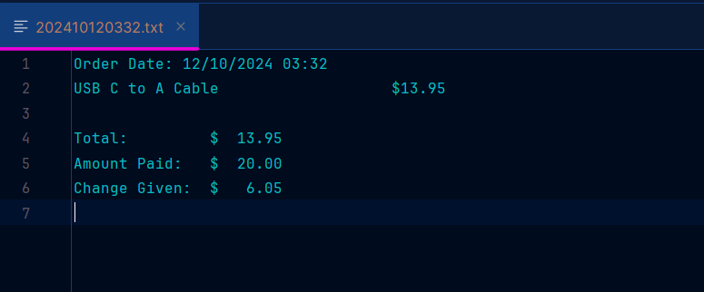

# Online Store

## Main Screen

To start up the Online Store, run the StoreFront.java file, and you will see the main menu

Entering the number keys from the selection takes you to different screens of the program. The store is filled with
items from the Products.CSV and can be added to your cart by displaying all products

## Displaying all Products

By pressing "1" you are able to show all the products that is in stock in the store.

Here you are able to search for an items or from the list you are able to add the item straight to the cart.

## Searching for a Product

By pressing "1" you are able to search by department, name, price (Searches for items with a lower price than inputted),
and SKU

Searching is not case-sensitive and if you accidentally try to search something you are
able to enter "x" to escape the search. Once you add one item to your list you are prompted if you want to add another
one

## Viewing the Cart

If you go back to the main screen you are able to view your cart after adding items to it and shows the total price.

Using the numbers given you are able to check out or remove a product from the cart, and check out everything 
in your cart.

## Checkout 

When checking out the program prompts you for how much you are paying and which then if you have enough will print and make a timestamped CSV file of your receipt.

## Authors
Jacob :)
